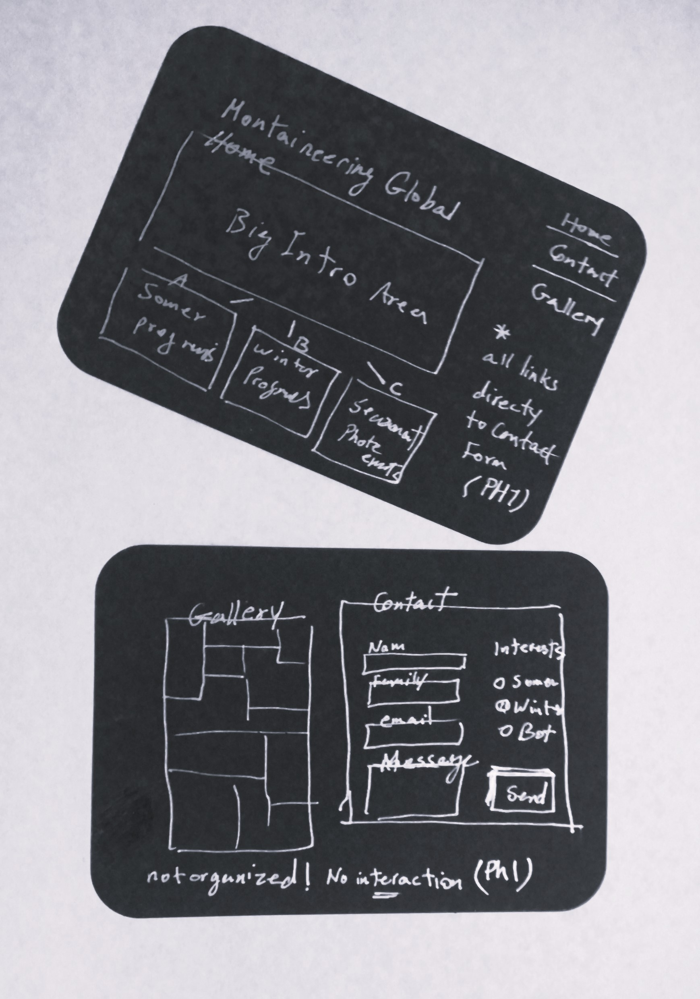
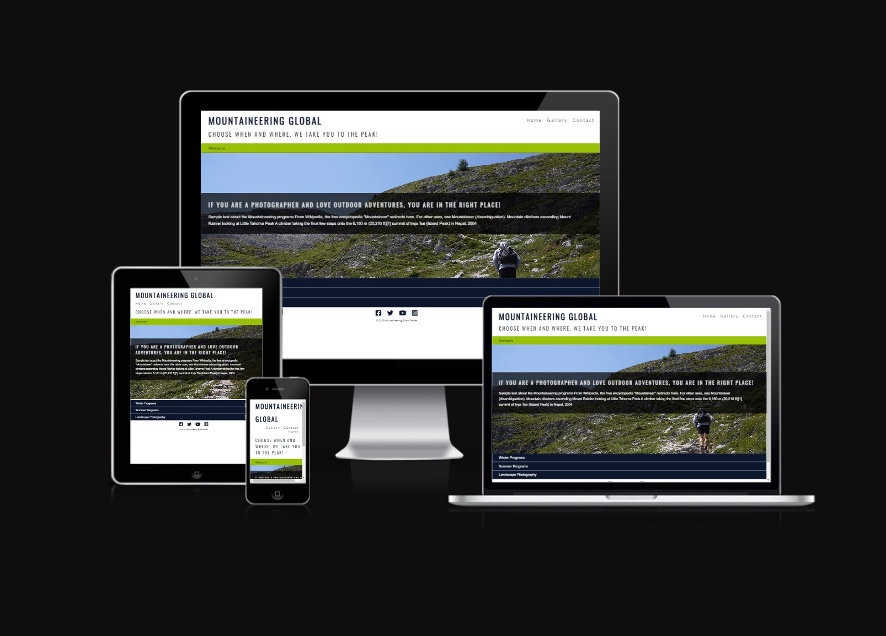

# MOUNTAINEERING GLOBAL

## Offering professional services for photography in the mountains.

This website is developing in parallel to forming a new business idea that combines mountaineering and 
professional photography services for experts interested in crossing over to the other domain. 
Using only HTML 5 and CSS 3 is the first choice to get a static responsive website running fast. 

 

## Business Requirements [Phase I]
* Creative design to represent the main branches of the business
    * Welcome and introduction to our business
    * Introduction to professional summer programs.
    * Introduction to professional winter programs.
    * Introduction to planned four-season photography programs.
* Simple photo gallery to showcase our artistic side!
* Simple contact form supporting lengthy messages!
* Access to social media directly

* Users Experience
	* 4-5 clicks away for the user to get in touch with us! 
	* easy navigation, proper visual experience
	* comfortable with any device size

## Delivered Product

[Visit live](https://nb1355.github.io/projects-c001-prd/)

## Next Phase Potential Features
* Interactive Event Calander
* Interactive Galley
* Registration and autentication
* online shop

## Technology / Tools

* The project uses HTML 5 to create the content.
* The project uses CSS 3 to style the content and provide the layout.
* The project uses GitHub:
	* GitPod to create and edit the project files (HTML 5 and CSS 3).
	* Git to add, commit, and push the project files to GitHub.
	* GitHub Pages turns GitHub Repositories into Websites.
	* Using the GitPod Full Template from the Code Institute.
    * [W3C CSS Validator](https://jigsaw.w3.org/css-validator/)
    * [W3C Markup Validator](https://validator.w3.org/)

## External Resources
* [Google fonts]('https://fonts.googleapis.com/css?family=Montserrat:300') using Google fonts Ozwald and Lato in different sizes for all text 
* [Font Awesome](https://fontawesome.com/) icons for visual elements to key elements
* [@kraigadams ]("https://www.youtube.com/embed/WKcnvPDgifA?autoplay=1&mute=1") sample hiking video used as home 1st background
* [Thephotoargus](https://www.thephotoargus.com/most-famous-mountains-in-the-world-to-photograph/) source for the pictures 

## General Knowledge and Hours of Reading
* [W3schools](https://www.w3schools.com/)
* [Website: CSS Tricks](https://css-tricks.com/)
* [Master CSS Grids](https://mozilladevelopers.github.io/playground/css-grid/)
* [Stackoverflow](https://stackoverflow.com/)
* [codepen](https://codepen.io/mperetto/pen/QYQEGK)
*

## Testing
### Manual Testing Technology
The following combination of software and hardware is used for all tests:

* Chrome on MacOSX (MacBook Pro) for both laptop/large display and mobile devices (inspect --> responsive).
* Firefox Developer Edition on MacOSX (MacBook Pro) for both laptop/large displays and mobile devices (Web Developer Tools --> Responsive Design Mode).
* Safari on MacOSX (MacBook Pro) for laptop/large display testing.
* Physical devices: Samsung Galaxy Note 10+ 5G with Chrome, Samsung Browser and Firefox. Apple iPhone 8 with Chrome and Safari.

[Test Case Walkthrough Video - A Summary](https://youtu.be/w1bz3HG6KsE)

### Manual Testing Criteria
The Acceptance Criteria are a compressed (simplified) version of the Use Cases described under section Processes --> UX:

1. View/Check Dates and Location/Book Course/Coaching/Programmes.
	1. 	Click on the hamburger-menu on the top-right corner.
	2. Click on the menu choice you're interested in: Home, Organisations, Individuals, Programmes.
	3. Click on the course of interest (course detail modal appears).
	4. Course detail modal contains the course header, the closing 'x', the course description, course Dates & Times, Location/Address, and a 'Book Now!' button.
		1. 	Click on the Course Dates & Time text link or date icon.
		2. View the Google Calendar with courses, dates and times (opens in a new tab).
		3. Go back to the website and click on Location: GaffCo Consulting or the location-arrow icon.
		4. View the Google Maps address.
		5. Go back to the website and click on the 'Book Now!' or closing 'x' button. The course details modal closes (not yet implemented a function for the 'Book Now!' button).

2. Credibility Check on Resumé
	1. Click on the Professional Trainer and Coach link text or graduation-cap icon or tool-tip (opens in a new tab).
	2. View the Resumé website (based on the Rosie Odenkirk walkthrough).

3. Location/Address
	1. Click on Copyright 2020 GaffCo Consulting or associated location-arrow or tool-tip.
	2. View the Google Maps location.

4. Call
	1. Click on the phone icon or tool-tip.
	2. On mobile devices the phone-call is added to the phone app screen or in Skype for Business or another associated app. On laptops/desktops it opens Skype for Business or another associated app.
	3. Call and talk...

5. WhatsApp
	1. Click on the WhatsApp icon or tool-tip.
	2. On mobile devices WhatsApp opens with a suggested message of 'Training and Development Opportunity'. On laptops/desktops it opens WhatsApp if installed or looks for another associated app. Will fail otherwise.
	3. Write a pleasant message and send...

6. Email
	1. Click on the Email icon or tool-tip.
	2. On mobile devices Google Mail opens with an empty email with the send-to address filled in (naoise.gaff.gaffney@gmail.com). On laptops/desktops it opens Google Mail if installed or looks for another associated app. Will fail otherwise.
	3. Write a pleasant message and send...

7. LinkedIn
	1. Click on the LinkedIn icon or tool-tip.
	2. A new tab with LinkedIn opens.
	3. If logged in, click on Message.
	4. Write a pleasant message and send...

8. YouTube
	1. Click on the YouTube icon or tool-tip.
	2. A new tab with a YouTube channel opens.
	3. Enjoy the content...

### Testing Notes
All devices and formats are tested in both portrait and landscape mode. The website is responsive and supports all tested browsers.

A couple of things to note:

* Safari does not support background images which is why a background colour is defined instead.
* On the smallest devices (Galaxy S5 and Apple iPhone 5) some of the course menus (Flex Div) slide under the fixed footer, meaning that the only way to click on the bottom-most course detail is to do so in portrait-mode.
* The course detail modal is set to `z-index: 4` to lie on top of the fixed footer and hamburger-menu. As the footer is fixed the course detail modal is scrollable to allow the user to read all the information and click on all the icons and buttons.

### HTML and CSS Validation: [Nu HTML and CSS Checker](https://validator.w3.org/nu/)

CSS Check! :-)

HTML:

* index.html: Error: Attribute tool-tip not allowed on element i at this point.
* organisations.html: Error: Attribute tool-tip not allowed on element i at this point.
* individuals.html: Error: Attribute tool-tip not allowed on element i at this point.
* programmes.html: Error: Attribute tool-tip not allowed on element i at this point.

The "Error: Attribute tool-tip not allowed on element i at this point." errors are not important as the tool-tip function is best attached to the FontAwesome icons to provide the required functionality.

## Deployment
For this project a combination of Repl-it~ and GitPod were originally used, then for the sake of speed, stability, and ease-of-use I moved over to Visual Studio Code for coding, and using the Source Code Management provider with git to synch (stage, commit, synch) my updates to GitHub.

I initially used Repl.it~ for testing and trialing new ideas and features, and GitHub/GitPod for the main stable development environment. I had issues with both Repl.it~ and GitPod which made development testing an annoyance. Repl.it~ freezes from time to time, and updates the development environment (losing connectivity) in mid-work. GitHub/GitPod can take several minutes in the worst instances to update the changes made to either HMTL or CSS files, and at times the preview didn't display the background image used for this project (worked in a separate tab).

Visual Studio Code is the development platform of choice from now on, together with GitHub for deployment and GitPages for publishing.

I'm working off of the same main branch on GitHub, though I have a staging environment on DropBox for Visual Studio Code.

When initially using Repl.it~ I did nothing beyond using the built-in features to save, deploy, and publish the website.

When using GitHub/GitPod I perform the following steps:

* Testing and Development
	* In the terminal I ran: `python3 -m http.server` to start the web server.
	* Clicked on Open Browser for port 8000 to view the web pages.
	* The preview browser doesn't show the background image, though shows all the updates immediately.
* Deployment
	* In the terminal I ran:
		* `git add .` to track all new and modified files from the working directory to the staging area.
		* `git commit -m "Relevant text goes here..."` to save all staged changes, along with a brief description from the user, in a “commit” to the local repository.
		* `git push` to push changes in the local repository to the GitHub.
* Publishing
	* [Project Repository](https://github.com/NaoiseGaffney/Professional-Training-Development)
		* Click on Settings. Scroll down to GitHub Pages.
		* Under Source click on the Select Source button, and select 'master branch'.
		* After a couple of minutes a message above Source says the following: "Your site is published at https://naoisegaffney.github.io/Professional-Training-Development/".
		* Click on the link to access the published website: [Professional Training and Development](https://naoisegaffney.github.io/Professional-Training-Development/)

Local deployment is performed in Visual Studio Code to the local LiveServer Web Server.

When using Visual Studio Code with GitHub I perform the following steps:

* Testing and Development
	* As I work in Visual Studio Code and make changes in any code, as soon as I save the changes the LiveServer Web Server automatically updates the browser to show the changes.
	* I use separate versions for testing and development.
		* Testing consists of trying new features and functions as snippets first, then in the current code, and when all works well the code is transferred to my main development environment.
* Deployment
	* To track all new and modified files from the working directory to the staging area.
		* Click on Source Control (branch-icon on the left of the screen).
		* Click on More Actions... (...) and click on 'Stage All Changes'
	* To save all staged changes, along with a brief description from the user, in a “commit” to the local repository.
		* Click on Source Control (branch-icon on the left of the screen).
		* Click on More Actions... (...) and click on 'Commit All'
		* Enter a short description in the text box and press Enter.
	* To push changes in the local repository to the GitHub.
		* Click on Source Control (branch-icon on the left of the screen).
		* Click on More Actions... (...) and click on 'Commit All'
* Publishing
	* Go to (click on link) [Project Repository](https://github.com/NaoiseGaffney/Professional-Training-Development)
		* Click on Settings. Scroll down to GitHub Pages.
		* Under Source click on the Select Source button, and select 'master branch'.
		* After a couple of minutes a message above Source says the following: "Your site is published at https://naoisegaffney.github.io/Professional-Training-Development/".
		* Click on the link to access the published website: [Professional Training and Development](https://naoisegaffney.github.io/Professional-Training-Development/)

## Credits     ?????

Code Institute Mentor - [GitHub: 5pence - Spencer Barriball](https://github.com/5pence)

## Acknowledgements
###  * Special thanks to my mentor Naoise Olof Seán Gaffney, for supporting me in designing and developing the concept.

